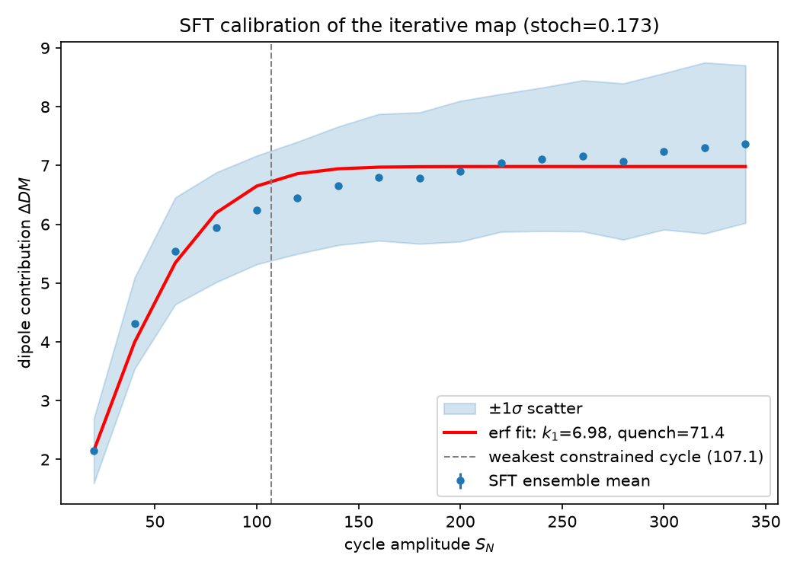

# sftmap — Observation-Constrained Iterative-Map Calibration via Surface Flux Transport

A reusable Python workflow that connects the parameters of the one-dimensional
**solar-cycle iterative map** to the physics of the **Babcock–Leighton (B-L)
dynamo**, through **surface-flux-transport (SFT)** simulations of
observation-constrained active-region (AR) emergence.

It implements the project
*"Observation-Constrained Iterative Map Calibration via Surface Flux Transport
Simulations"* (M. H. Talafha, RISE, University of Sharjah) and builds directly on
the iterative map of Wang, Jiang & Wang (2025, Papers I & II) and the B-L
quantification of Jiang (2020, "J20"). It grew out of, and reuses the SFT physics
of, the original [`SFT`](https://github.com/mtalafha90/sft) project (`transp.py`),
which is refactored here into a clean, modern Python package.

## The iterative map

Cycle `n+1`'s amplitude `SN(n+1)` (maximum 13-month-smoothed SSN v2) follows
from cycle `n`'s amplitude via

```
SN(n+1) = k0 · k1 · erf( SN(n) / quench ) · (1 + stoch · X) − SN(n)
```

with a reflecting boundary at `SN = 0` (`X` is a standard normal variable). The
two right-hand terms are the **nonlinear, stochastic poloidal-field generation**
(the increase-then-saturate `ΔDM = k1·erf(SN/quench)·(1+stoch·X)`) and the
**Hale-law cancellation** of the previous cycle's dipole. The four parameters
are:

| parameter | meaning | standard (J20) |
|-----------|---------|---------------:|
| `k0` | polar-precursor coefficient (linear Ω-effect) | 58.7 |
| `k1` | saturated dipole contribution of a strong cycle | 6.94 |
| `quench` | saturation scale in sunspot number | 75.85 |
| `stoch` | std. of the multiplicative B-L stochasticity | 0.17 |

This package **derives `k1`, `quench` and `stoch` from physics** rather than
assuming them: it generates synthetic ARs for a prescribed cycle amplitude
(with tilt quenching, latitude quenching and realistic scatter), transports
their flux to the pole, measures the cycle's dipole contribution `ΔDM`, and
fits the resulting `ΔDM(SN)` relation to the `erf` law above.

## How the code maps to the project objectives

| Proposal objective | Module / script |
|--------------------|-----------------|
| 1. Physically calibrate `(k1, quench, stoch)` from SFT | [`sftmap/calibration.py`](sftmap/calibration.py) · `scripts/run_calibration.py` |
| 2. Quantify `ΔDM(SN)`: mean trend **and** stochastic scatter | [`sftmap/ar_emergence.py`](sftmap/ar_emergence.py) + [`sftmap/sft.py`](sftmap/sft.py) |
| 3. Validate against the amplitude PDF and the G–O rule | [`sftmap/validation.py`](sftmap/validation.py) · [`sftmap/go_rule.py`](sftmap/go_rule.py) · `scripts/run_go_rule.py` |
| 4. Probabilistic prediction with uncertainty | [`sftmap/iterative_map.py`](sftmap/iterative_map.py) · `scripts/predict_cycle.py` |

### The forward-modelling pipeline

```
ar_emergence ──▶ sft ──▶ calibration ──▶ iterative_map ──▶ validation
 (synthetic     (AR →     (MC ensembles    (recursion        (PDF, G–O rule,
  ARs with       axial-    → fit ΔDM(SN)     SN(n+1)=…)        prediction)
  quenching)     dipole)   → k1,quench,stoch)
```

* **`ar_emergence`** — synthetic AR populations for a given `SN`, with **tilt
  quenching** (Joy's-law coefficient ↓ with cycle strength; Dasi-Espuig et al.
  2010), **latitude quenching** (mean emergence latitude ↑ with cycle strength;
  Li et al. 2003) and per-AR scatter in tilt/latitude/flux (the B-L
  stochasticity).
* **`sft`** — converts each AR to its contribution to the axial dipole moment,
  either with a fast **semi-analytic surrogate** (BMR final-dipole transfer
  function, `∝ Φ·sin(tilt)·cos λ·exp(−λ²/2λ_R²)`; Petrovay et al. 2020) or with a
  full **1-D PDE solver** (meridional advection + supergranular diffusion +
  optional decay), refactored and modernised from the original `transp.py`.
* **`calibration`** — runs Monte-Carlo ensembles across a grid of `SN`, builds
  `ΔDM(SN)` and its scatter, and fits `(k1, quench, stoch)`.
* **`iterative_map`** — the recursion, fixed point, Lyapunov exponent, amplitude
  PDF and probabilistic prediction.
* **`go_rule`** / **`validation`** — E-to-A ratio, `ΔSN` distribution, E-O/O-E
  correlations, block-length distributions, grand-maxima fraction.

## Installation

```bash
git clone <this-repo-url>
cd sft-iterative-map
pip install -r requirements.txt          # numpy, scipy, matplotlib
pip install -e .                          # optional: console scripts + import anywhere
```

## Usage

### Command line

```bash
# 1. Calibrate (k1, quench, stoch) from SFT simulations of AR emergence
python scripts/run_calibration.py --realizations 500 --out calibration.png

# 2. Map analysis: cobweb diagram, amplitude series, amplitude PDF
python scripts/run_map_analysis.py --param standard --out map_analysis.png

# 3. Gnevyshev–Ohl rule statistics
python scripts/run_go_rule.py --n 1000000 --out go_rule.png

# 4. Predict the next cycle (e.g. cycle 25 amplitude 150 → cycle 26)
python scripts/predict_cycle.py 150
python scripts/predict_cycle.py 150 --horizon 6     # multi-cycle forecast
```

### Library

```python
import numpy as np
from sftmap import calibration, iterative_map as im, go_rule

# Calibrate the map parameters from emergence + SFT
res = calibration.calibrate(n_realizations=500, seed=0)
print(res.summary())          # k1 ≈ 6.94, quench ≈ 72, stoch ≈ 0.17
p = res.parameters()

# Use the calibrated map to predict and to study variability
print(im.predict_next(150.0, p))                   # next-cycle forecast
series = im.generate_series(1_000_000, p=p, seed=0)
print(go_rule.go_statistics(series))               # E-to-A ratio, blocks, …
```

## Results — benchmark reproduction

With the default observation-constrained emergence model, the **calibration
recovers the J20 / Wang standard set** almost exactly:

| | `k1` | `quench` | `stoch` |
|---|----:|------:|------:|
| **Calibrated here** | 7.0 | 72 | 0.17 |
| J20 / Wang et al. | 6.94 | 75.85 | 0.17 |

and the calibrated map reproduces the published statistical signatures:

| diagnostic | this code | Wang et al. (2025) |
|------------|----------:|-------------------:|
| cycle-26 prediction from `SN=150` | 255 ± 69 | 255 ± 69 (Paper I) |
| amplitude-PDF peak | ≈ 217 | ≈ 200 (Paper I) |
| grand-maxima fraction (`SN>258`) | 0.247 ± 0.010 | 0.25 ± 0.01 (Paper I) |
| Lyapunov exponent | < 0 (no chaos) | < 0 (Paper I) |
| E-to-A ratio | 0.454 | 0.4555 (Paper II) |
| `ΔSN` mean / median / std | 0 / 20 / 157 | 0 / 19 / 157 (Paper II) |
| E-O / O-E correlation | −0.42 / −0.42 | −0.42 (Paper II) |



## Repository layout

```
sftmap/             core package
  ar_emergence.py     synthetic AR emergence (tilt + latitude quenching)
  sft.py              AR → axial dipole: surrogate + full 1-D PDE solver
  calibration.py      MC ensembles → fit ΔDM(SN) → (k1, quench, stoch)
  iterative_map.py    the recursion, fixed point, Lyapunov, PDF, prediction
  go_rule.py          Gnevyshev–Ohl statistics
  validation.py       amplitude PDF, grand maxima, benchmark bundle
scripts/            command-line entry points
tests/              pytest suite (run: python -m pytest)
examples/           example output figures
```

## Testing

```bash
pip install pytest
python -m pytest -q
```

## References

1. Z.-F. Wang, J. Jiang & J.-X. Wang, *Observation-based Iterative Map for Solar
   Cycles. I. Nature of Solar Cycle Variability*, ApJ **984**, 183 (2025).
2. Z.-F. Wang, J. Jiang & J.-X. Wang, *Observation-Based Iterative Map for Solar
   Cycles. II. The Gnevyshev–Ohl Rule and its Generation Mechanism*, RAA
   **25**, 125013 (2025).
3. J. Jiang, *Nonlinear Mechanisms that Regulate the Solar Cycle Amplitude*, ApJ
   **900**, 19 (2020) ("J20").
4. M. Talafha et al., *Surface flux transport modelling*, A&A (2022); and the
   original [`SFT`](https://github.com/mtalafha90/sft) code this package extends.

## License

GPL-3.0-or-later (see [LICENSE](LICENSE)), inherited from the original SFT project.
